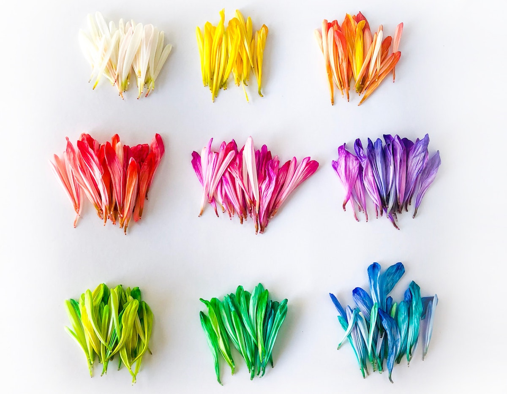
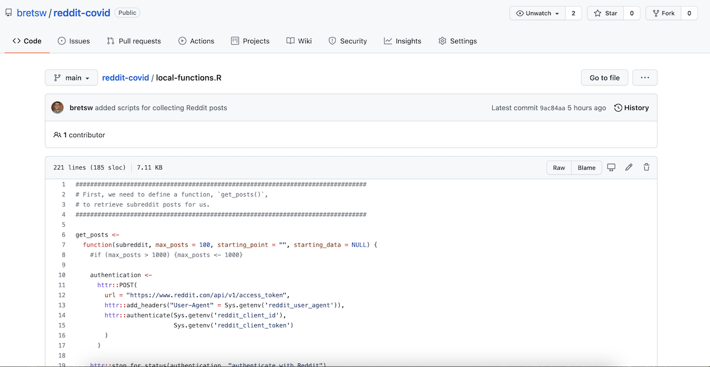

```{r setup, include=FALSE}
usethis::use_git_ignore(c("*.csv", "*.rds"))
options(htmltools.dir.version = FALSE)

library(knitr)
library(tidyverse)
library(xaringan)
library(fontawesome)
library(igraph)
library(tidygraph)
library(ggraph)
library(ggthemes)
library(cowplot)
library(kableExtra)
```

class: inverse, center, middle

# `r fa("far fa-images", fill = "#fff")`

**View the slides:** 

[bretsw.com/eme6356-su24-module4](https://bretsw.com/eme6356-su24-module4)

---

class: inverse, center, middle

# `r fa("fas fa-comments", fill = "#fff")` <br><br> Looking Back at Module 3

---

# `r fa("fas fa-comments", fill = "#fff")` Problem Conceptualization

```{r, out.width = "600px", echo = FALSE, fig.align = "center"}
include_graphics("img/mosaic.jpg")
```

**Wide variety of problems that could be addressed with analytics:**

--

- Students' attention span, motivation, retention

--

- What else?

---

# `r fa("fas fa-comments", fill = "#fff")` Data Collection

```{r, out.width = "600px", echo = FALSE, fig.align = "center"}
include_graphics("img/data-collection-medium.jpg")
```

--

- Starting with a **clear problem** is absolutely vital: What do you want to know?

--

- What **theory** or framework will help you know where and how to look at the data?

--

- What data will address the problem? What will help you find what you want to know?

---

# `r fa("fas fa-comments", fill = "#fff")` Data Collection

```{r, out.width = "600px", echo = FALSE, fig.align = "center"}

```

- How much data do you need?

--

- How will manage to collect all of that data?

---

# `r fa("fas fa-comments", fill = "#fff")` Data Analysis

```{r, out.width = "540px", echo = FALSE, fig.align = "center"}

```

--

- How will you make sense of the data you've collected?

--

- Who could you ask to lend their expertise? (e.g., [FSU Statistical Consulting Center](https://stat.fsu.edu/consulting-center))

---

class: inverse, center, middle

# `r fa("fas fa-question", fill = "#fff")` <br><br> Module 3 <br> Final Thoughts?

---

class: inverse, center, middle

# `r fa("fas fa-chart-line", fill = "#fff")` <br> <br> Module 4: <br> Web Analytics

---

class: inverse, center, middle

# `r fa("fas fa-chart-line", fill = "#fff")` <br> <br> **Defining Analytics**

**Measure `r fa("fas fa-arrow-right", fill = "#fff")` Collect `r fa("fas fa-arrow-right", fill = "#fff")` Analyze `r fa("fas fa-arrow-right", fill = "#fff")` Report**

---

class: inverse, center, middle

# `r fa("fas fa-chart-line", fill = "#fff")` <br> <br> **Web Analytics**

**(Activity Online)**

---

# `r fa("fas fa-chart-line", fill = "#fff")` Activity Online

```{r, out.width = "600px", echo = FALSE, fig.align = "center"}
include_graphics("img/social-media-phone.jpg")
```

Measure `r fa("fas fa-arrow-right", fill = "#782F40")` Collect `r fa("fas fa-arrow-right", fill = "#782F40")` Analyze `r fa("fas fa-arrow-right", fill = "#782F40")` Report

--

### `r fa("fas fa-question", fill = "#fff")` **What might we measure?**

---

# `r fa("fas fa-chart-line", fill = "#fff")` Activity Online

```{r, out.width = "600px", echo = FALSE, fig.align = "center"}
include_graphics("img/social-media-phone.jpg")
```

- From whom do teachers seek professional advice online?

--

- With whom do participants interact in an online forum?

--

- How does the language used in course catalogs match that in job ads?

---

class: inverse, center, middle

# `r fa("fas fa-dice-one", fill = "#fff")` `r fa("fas fa-dice-two", fill = "#fff")` `r fa("fas fa-dice-three", fill = "#fff")` `r fa("fas fa-dice-four", fill = "#fff")` `r fa("fas fa-dice-five", fill = "#fff")` `r fa("fas fa-dice-six", fill = "#fff")`<br> <br> **Web Analytics** <br><br> Examples

---

# `r fa("fas fa-dice-one", fill = "#fff")` Web Analytics Example 1

### **Google Analytics**

```{r, out.width = "100%", echo = FALSE, fig.align = "center"}

```

[Google Analytics dashboard](https://analytics.google.com/analytics/web/)

---

# `r fa("fas fa-dice-two", fill = "#fff")` Web Analytics Example 2

### **Google BigQuery**

```{r, out.width = "100%", echo = FALSE, fig.align = "center"}
include_graphics("img/4-google-bigquery.png")
```

[Google BigQuery dashboard](https://console.cloud.google.com/bigquery)

---

# `r fa("fas fa-dice-three", fill = "#fff")` Web Analytics Example 3

### **Webpage JSON**

```{r, out.width = "100%", echo = FALSE, fig.align = "center"}

```

[Reddit r/Teachers JSON](https://www.reddit.com/r/Teachers.json)

---

# `r fa("fas fa-dice-four", fill = "#fff")` Web Analytics Example 4

### **Reddit API**

```{r, out.width = "100%", echo = FALSE, fig.align = "center"}

```

[Reddit API](https://github.com/bretsw/reddit-covid/blob/main/local-functions.R)

---

# `r fa("fas fa-dice-five", fill = "#fff")` Web Analytics Example 5

### **PoliDashboard: Facebook Political Ads**

```{r, out.width = "360px", echo = FALSE, fig.align = "center"}

```

[PoliDashboard from Social Media Lab](https://app.polidashboard.org/facebook_ads_v2?country=ca)

---

# `r fa("fas fa-dice-six", fill = "#fff")` Web Analytics Example 6

### **Scraping a job board** 

```{r, out.width = "520px", echo = FALSE, fig.align = "center"}

```

**[Google Jobs](https://jobs.google.com/)**

---

# `r fa("fas fa-dice-six", fill = "#fff")` Web Analytics Example 6

### **Scraping a job board** 

```{r, out.width = "100%", echo = FALSE, fig.align = "center"}

```

**[SerpApi](https://serpapi.com/)**

---

# `r fa("fas fa-dice-six", fill = "#fff")` Web Analytics Example 6

### **Scraping a job board** 

```{r, out.width = "100%", echo = FALSE, fig.align = "center"}

```

**[SerpApi](https://serpapi.com/)**

---


class: inverse, center, middle

# `r fa("fas fa-question", fill = "#fff")` <br><br> **What might we measure?**

---


class: inverse, center, middle

# `r fa("fas fa-binoculars", fill = "#fff")` <br><br> Looking ahead

---

# `r fa("fas fa-calendar-day", fill = "#fff")` Semester schedule

```{r, out.width = "720px", echo = FALSE, fig.align = "center"}
include_graphics("img/across-time.jpg")
```

- **Module 1:** Introduction to Analytics
- **Module 2:** Performance Analytics
- **Module 3:** Learning Analytics
- **Module 4: Web Analytics**
- **Module 5:** Data Visualization
- **Module 6:** Ethics in Learning Analytics
- **Module 7:** Future of Analytics
- **Module 8:** Case Discussions

---

# `r fa("fas fa-calendar-day", fill = "#fff")` Module structure

```{r, out.width = "480px", echo = FALSE, fig.align = "center"}
include_graphics("img/workshop.jpg")
```

- `r fa("video", fill = "#782F40")` Watch

- `r fa("compass", fill = "#782F40")` Explore

- `r fa("book-open", fill = "#782F40")` Read

- `r fa("comments", fill = "#782F40")` Discuss

- `r fa("fas fa-keyboard", fill = "#782F40")` Create

---

# `r fa("fas fa-calendar-day", fill = "#fff")` Upcoming Assignments

```{r, out.width = "600px", echo = FALSE, fig.align = "center"}
include_graphics("img/build.jpg")
```

### Analytics Practice (100 points) - **due end of Module 5**

---

class: inverse, center, middle

# `r fa("fas fa-question", fill = "#fff")` <br><br> Questions

<hr>

**What questions can I answer for you now?**

**How can I support you this week?**

<hr>

`r fa("envelope", fill = "#fff")` [bret.staudtwillet@fsu.edu](mailto:bret.staudtwillet@fsu.edu) | `r fa("globe", fill = "#fff")` [bretsw.com](https://bretsw.com) | `r fa("fab fa-github", fill = "#fff")` [GitHub](https://github.com/bretsw/)

---

class: inverse, center, middle

# Learn to Code

```{r, out.width = "320px", echo = FALSE, fig.align = "center"}
include_graphics("img/dsieur.jpg")
```

**https://datascienceineducation.com/**

---

class: inverse, center, middle

# `r fa("fas fa-otter", fill = "#fff")` <br><br> Play in the <br> [Analytics Sandbox](https://bretsw.com/sandbox)

`r fa("fab fa-github", fill = "#fff")` [GitHub repository for code and data](https://github.com/bretsw/sandbox)

`r fa("fas fa-cubes-stacked", fill = "#fff")` [Datasets for practice](https://bretsw.com/post/datasets/)
